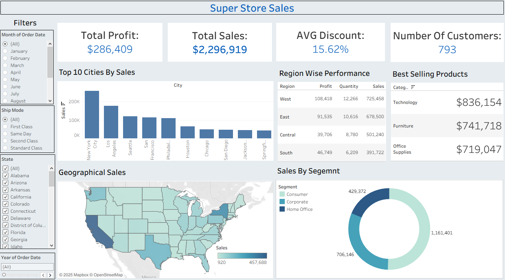

# 📊 Tableau Superstore Sales Dashboard

## 📌 Project Overview
This project focuses on analyzing sales performance using **Tableau**.  
The goal was to build an **interactive dashboard** that provides clear insights into sales, profit, and customer behavior across different **regions, categories, and segments**.  

The dataset used is Tableau’s **Sample Superstore** dataset — a retail dataset that includes sales, profit, discount, and customer details.

---

## 🛠 Tools & Skills Used
- **Tableau Desktop** – Data visualization and dashboard creation  
- **Data Analysis** – Regional, Category, and Segment-level insights  
- **KPI Design** – Total Sales, Profit, Discount %, and Customer Count  
- **Interactive Dashboard** – Filters for Month, State, Ship Mode, and Year  

---

## 📂 Project Steps

### 1️⃣ Data Preparation
- Connected Tableau to the Superstore dataset  
- Verified data fields, data types, and corrected naming inconsistencies  
- Created calculated fields for key performance indicators (KPIs)

### 2️⃣ KPI & Visualization Design
- Designed four key KPIs: **Total Profit**, **Total Sales**, **Average Discount**, and **Number of Customers**
- Built visualizations including:
  - *Top 10 Cities by Sales* (bar chart)
  - *Regional Performance Table*
  - *Best-Selling Categories*
  - *Geographical Sales Map*
  - *Sales by Segment* (donut chart)

### 3️⃣ Dashboard Creation
- Combined all visuals into a single, clean, and interactive layout  
- Added slicers for **Month**, **Ship Mode**, **State**, and **Year**  
- Used consistent colors and formatting for readability and usability  

---

## 📊 Dashboard Insights

| KPI | Value |
|-----|--------|
| 💰 **Total Sales** | **$2,296,919** |
| 📈 **Total Profit** | **$286,409** |
| 🎯 **Average Discount** | **15.62%** |
| 👥 **Number of Customers** | **793** |

### 🔹 Key Findings
- **Top Regions:** West and East lead in both sales and profit  
- **Top Category:** Technology ($836K in sales) is the best-selling segment  
- **Most Profitable Cities:** New York and Los Angeles generate the highest revenue  
- **Geographical Trend:** Coastal regions outperform central areas in both sales and quantity  

---

## 📈 Key Outcomes
- Developed a **fully interactive Tableau dashboard** for business insights  
- Enabled quick regional and category-level performance comparisons  
- Improved data storytelling with KPI-driven visuals and clear design  

---

## 💡 Future Improvements
- Add **trend analysis** for month-over-month and year-over-year growth  
- Integrate **customer segmentation** and loyalty metrics  
- Implement **forecasting** features using Tableau’s analytics capabilities  

---

## 🖼 Dashboard Preview

---

## 🧰 Dataset
- **Source:** Tableau’s Sample Superstore dataset  
- **Data Type:** Retail sales data (Orders, Customers, Products, and Regions)

---

## 📬 Contact
Created by **Ahmed Medhat**  
📧 Feel free to reach out for collaboration or data analysis projects!  

---

